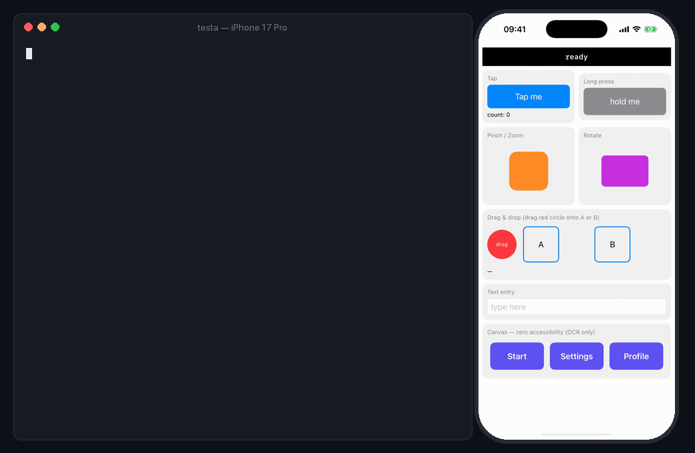

<div align="center">

# Testa

**Let your AI agent test your iOS app.**

[](https://github.com/valewnrt/testa/actions/workflows/ci.yml)
[](https://github.com/valewnrt/testa/actions/workflows/xcode-beta.yml)
[](https://github.com/valewnrt/testa/releases)
[](LICENSE)

</div>

Testa gives Claude Code, Codex, Cursor or any MCP client eyes and hands in the
iOS Simulator. It reads the screen as compact text, taps, types and swipes with
real touch events, and checks the result. It works with React Native, Expo and
SwiftUI apps, and you don't have to add a single `testID`. When the agent is
done, save the run as a flow file and replay it in CI without a model.

<p align="center">
  
</p>

## Install

Requires macOS with Xcode 26 (iOS 26 simulators).

```bash
brew tap valewnrt/testa
brew install testa
testa setup        # installs the Claude Code skill and registers the MCP server
```

Or build from source: `git clone https://github.com/valewnrt/testa && cd testa && ./install.sh`.

## Connect your agent

`testa setup` already configures **Claude Code**. For other agents:

```bash
codex mcp add testa -- testa mcp      # Codex
```

```json
{ "mcpServers": { "testa": { "command": "testa", "args": ["mcp"] } } }
```

The JSON goes into Cursor's `.cursor/mcp.json` or any other MCP client config.
Then ask your agent something like *"Launch the app in the simulator, sign up
with a test account and check that the welcome screen appears."*
More in [docs/agents.md](docs/agents.md).

## Try it yourself

Testa is a plain CLI, so you can drive it by hand too:

```console
$ testa boot "iPhone 17 Pro"
$ testa install ./MyApp.app && testa launch com.example.myapp

$ testa ui
19 elements (on screen)
e2 StaticText "ready" #status @201,89
e5 Button "Tap me" #tapButton @102,171
e18 TextField #textInput =type here @201,601
…

$ testa tap "Tap me"
tapped e5 Button Tap me
-- ui changes --
~ e2 StaticText "tap:1" #status @201,89
~ e6 StaticText "count: 1" #tapCount @41,208

$ testa assert "#status" label=tap:1
PASS label tap:1
```

The first command starts a background daemon (a few seconds, once). After that,
each command takes about 60 ms.

## What makes it different

- **No app changes needed.** Testa reads the accessibility tree and falls back
  to on-device OCR (Apple Vision) for anything that isn't in it: system sheets,
  canvas-drawn screens, games, WebViews. [More →](docs/ocr.md)
- **Built for token budgets.** A screen is one line per element, about 200
  tokens instead of about 1,500 for a screenshot, and every action replies with
  only what changed. [Benchmark →](bench/)
- **Record once, replay in CI.** `testa flow record` turns what the agent did
  into a plain-text flow file. `testa flow run` replays it with JUnit output and
  failure artifacts, and there's a GitHub Action. [More →](docs/flows-and-ci.md)
- **Real gestures and device control.** Tap, long-press, swipe, drag-and-drop,
  pinch, rotate, multi-touch and hardware buttons, plus push notifications,
  location, Face ID, dark mode, Dynamic Type and more.
- **One local binary, no dependencies.** Testa talks to Apple's simulator
  frameworks directly: no Node, no Python, no WebDriver server. No network, no
  telemetry. [How it works →](docs/architecture.md)

## Status

Testa is pre-1.0 and is used against real production apps. It relies on private
Apple frameworks, so a new Xcode can break it; a [weekly job](.github/workflows/xcode-beta.yml)
runs the suite against Xcode betas so breakage shows up early. Verified on Xcode 26.4 with
iOS 26.4 simulators. iOS Simulator only: no real devices, no Android
([why](docs/architecture.md#why-ios-only)).

## Documentation

- [Commands](docs/commands.md): selectors, the observe → act → verify loop, full reference
- [Using Testa from an AI agent](docs/agents.md): MCP setup, tools, token cost
- [Testing apps without testIDs](docs/ocr.md)
- [Flows & CI](docs/flows-and-ci.md): flow files, recording, GitHub Action
- [How it works](docs/architecture.md) · [Security model](docs/security.md)
- [How Testa compares](docs/comparison.md) to Maestro, Appium, idb and Argent
- [Troubleshooting & limitations](docs/troubleshooting.md)

## Contributing

Bug reports, Xcode-compatibility reports and pull requests are welcome. Start
with [CONTRIBUTING.md](CONTRIBUTING.md); questions and ideas go to
[Discussions](https://github.com/valewnrt/testa/discussions). Changes are listed
in the [CHANGELOG](CHANGELOG.md).

## Acknowledgements

Testa's HID and accessibility work was informed by studying Meta's
[idb](https://github.com/facebook/idb) (MIT); no idb code is linked or bundled.
Thanks to everyone who has [contributed](https://github.com/valewnrt/testa/graphs/contributors).

## License

[MIT](LICENSE)
