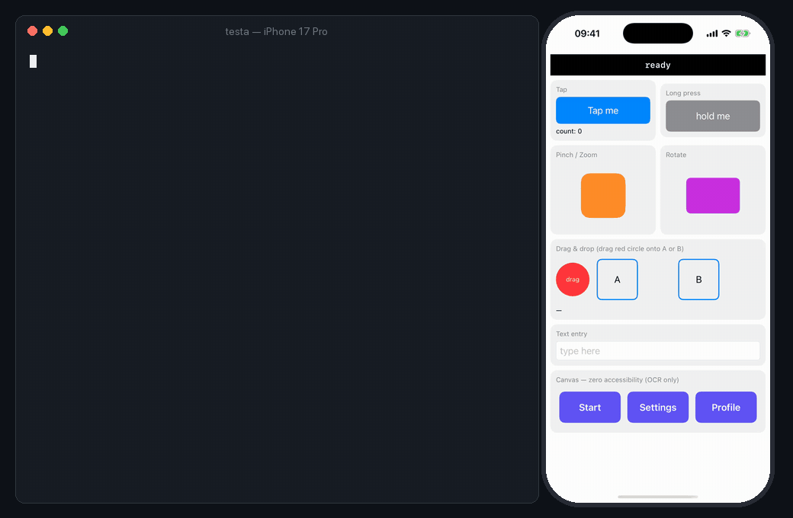

# Testing apps without testIDs

You don't need to add `testID`s or `accessibilityIdentifier`s before Testa can
drive your app. Visible text is enough.

- SwiftUI views and React Native `Text`, `Pressable` and `TextInput` already
  expose their text as accessibility labels, so `testa tap "Continue"` works out
  of the box.
- For everything else, `testa see` and `testa tapocr "<text>"` read the pixels
  with on-device Apple Vision. No API key, no network. This drives HealthKit
  permission sheets, canvas-rendered screens, games and WebViews that expose no
  accessibility at all.
- Matching is fuzzy (Levenshtein), so `tapocr "Settings"` still lands when OCR
  reads `Setting5`.
- `find`, `assert` and `wait` fall back to OCR too, and tell you when they did.

Adding identifiers still helps: it makes targeting exact and survives copy
changes.

## Example



The bottom tab row in the showcase is drawn with SwiftUI `Canvas`, so it exposes
no accessibility elements:

```console
$ testa ui            # accessibility tree
… no "Start" / "Settings" / "Profile" — they aren't accessibility elements

$ testa see           # on-device OCR
"Start" @79,702    "Settings" @200,703    "Profile" @322,702

$ testa tapocr "Settings"
tapped (ocr) "Settings" @200,703     →  #status = canvas:Settings

$ testa assert "Settings" exists
PASS exists (ocr) "Settings" @200,703
```

## Watch out for invisible characters

iOS system strings (permission alerts, SpringBoard) often contain non-breaking
spaces (U+00A0) and typographic quotes (`„ “ ‘ ’`). Testa's own matching is
case-insensitive and fuzzy, so selectors are unaffected. If *you* grep or
string-compare Testa's raw output, normalize whitespace and quotes first.
